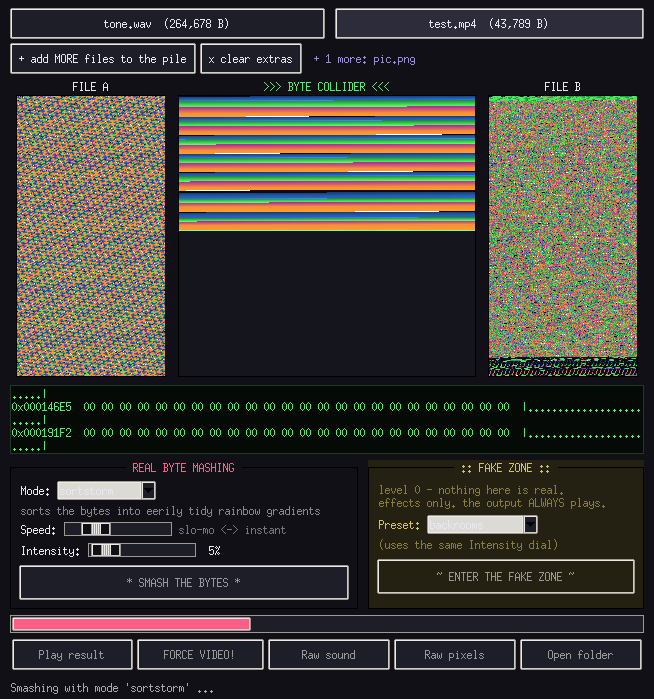
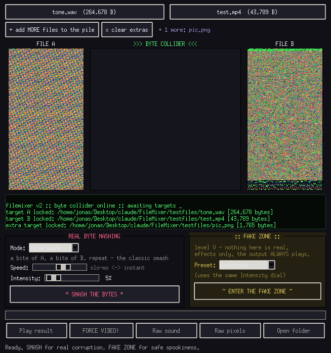
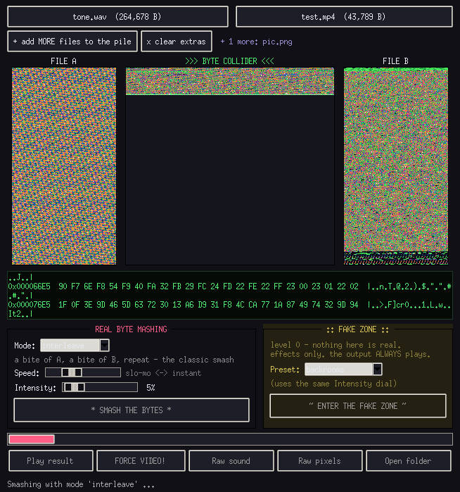
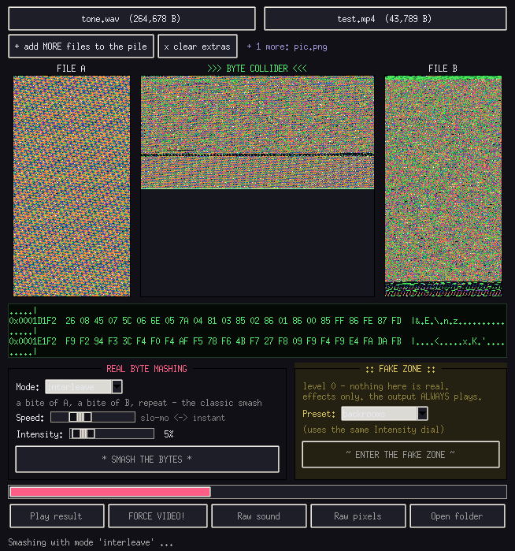
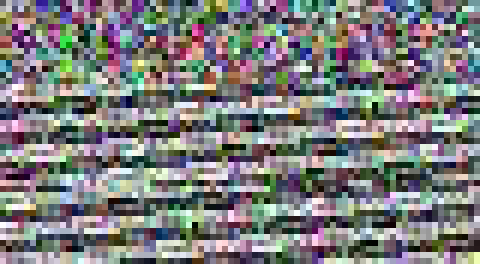
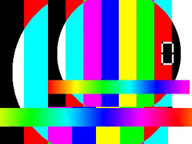

# FileMixer :: the byte collider

**Smash the raw bytes of two or more files together, watch them collide in
real time, then play the wreckage.** Databending as a desktop toy — a PNG
into an MP4, an MP3 into a PDF, five memes into each other. No tricks: the
real modes literally mix the actual bytes of your files.



## Features

- 🎛 **Visual byte collider** — both files' raw bytes rendered as colored
  pixels, the output painting itself live with a glowing write-head, and a
  scrolling hacker hex console
- 💥 **19 real byte-mashing modes** — from classic interleaving to bitwise
  math to `yeet`
- 📼 **datamosh mode** — the "bad wifi" smear: real keyframe packets deleted
  from the real stream, and it still plays
- 🎬 **remix mode** — decodes your files and splices real content together
  (photo chunks flashing inside a video), always playable
- 🚪 **FAKE ZONE** — backrooms-flavoured effect presets that always play,
  honestly labeled as fake
- 📺 **FORCE VIDEO** — any byte soup becomes a real playable MP4: the bytes
  are the pixels *and* the soundtrack
- 🔊 **Raw playback** — every byte as an audio sample, or as RGB pixels
  (auto-saved as a real WAV when you use the GUI)
- 🧑‍🚀 **2+ files** — pile up as many files as you want
- 🖥 GUI for humans, CLI for terminals; both share the exact same engine

## Screenshots

| Files loaded | Interleave, live | Finished |
|---|---|---|
|  |  |  |

### What the wreckage looks like

| FORCE VIDEO (bytes as pixels+sound) | datamosh smear | remix flash |
|---|---|---|
|  |  |  |

## Install

Needs Linux with Python 3.9+, `numpy`, `tkinter`, and the media tools:

```bash
# Arch
sudo pacman -S ffmpeg mpv python-numpy tk
# Debian/Ubuntu
sudo apt install ffmpeg mpv python3-numpy python3-tk

git clone https://github.com/KairoWolf/FileMixer.git
cd FileMixer
./run.sh          # launches the GUI
```

## Using the GUI

1. **Choose File A** and **File B** — any files at all. Use
   **"+ add MORE files to the pile"** for 3, 4, 10 files.
   The side panels show each file's actual bytes as colored pixels
   (green = text-like bytes, blue = control bytes, magenta/orange = high
   bytes, black = zeros).
2. Pick a mode in **REAL BYTE MASHING** (each mode shows a hint), set the
   **Speed** slider (slow-mo to watch the collision) and **Intensity**
   (for `sprinkle`, `remix`, `datamosh` and the FAKE ZONE), then hit
   **SMASH THE BYTES**.
3. Or step into the **FAKE ZONE**: pick a preset, enter, and get something
   eerie that is guaranteed to play (no bytes were harmed).
4. Play the wreckage:
   - **Play result** — health-checks the file first (frozen players can't
     happen); decodable files play in mpv, byte soup gets auto-FORCED into
     a video instead
   - **FORCE VIDEO!** — bytes become the pixels AND the sound of a new MP4
   - **Raw sound** — every byte as an audio sample, auto-saved as
     `<output>.rawsound.wav`
   - **Raw pixels** — the bytes as RGB video, the visualiser in reverse

Outputs land next to the scripts as `mashed_*`, `mosh_*`, `remix_*`,
`fake_*`. Your source files are **never modified**.

## The real modes

| Mode | What it does |
|---|---|
| `interleave` | a bite of each file in turn — the classic smash |
| `zipper` | single bytes alternating: a b c a b c |
| `splice` | randomly-sized bites — seeded chaos |
| `shuffle` | every file diced into chunks and shuffled together |
| `stutter` | file 1 st-st-stutters while the others barge in |
| `reverse` | file 1 forwards, every other file backwards |
| `sprinkle` | keeps file 1's layout; Intensity % of chunks get replaced. **1% = a video that still plays with a few glitches** |
| `waltz` | ONE two three — file 1 leads with double steps, the others follow |
| `drunk` | stumbles around ALL the files grabbing random gulps |
| `yeet` | interleaves everything but YEETS 25% of the chunks into the void |
| `sortstorm` | sorts the bytes into eerily tidy rainbow gradients |
| `scream` | every byte forced to 0 or 255. it screams. you were warned |
| `xor` / `add` / `subtract` / `and` / `or` / `rotate` / `blend` | byte math folded across all files' overlapping bytes |
| `datamosh` | the BAD WIFI smear: real keyframe packets deleted from the stream so frames melt and smear into each other — and it still plays |
| `remix` | the special one: **decodes** the files and splices real content into file 1 — photo chunks flashing inside a video, audio bursts invading a song, PDF bytes as noise — always playable |
| `curse` | **the full ritual**: remix + byte shrapnel + datamosh chained in one go. Maximum cursed, still playable. Video as file 1 required |

## The FAKE ZONE (level 0 — nothing here is real)

Eerie ffmpeg re-renders of file 1, flavoured by the other files' bytes. No
byte smashing, always playable, honestly labeled. Presets:

- `backrooms` — yellowed, humming, slightly wrong
- `poolrooms` — blue, wet, echoing tiles
- `the_void` — very dark, very far away, very muffled
- `vhs_nightmare` — tracking errors and channel bleed
- `datamosh_dream` — ghost trails and melted motion
- `static_ghost` — mostly static, something underneath
- `corridor_echo` — far away, echoing, don't turn around

The Intensity dial controls how deep you go.

## CLI cheatsheet

```bash
python3 filemixer.py a.png b.mp4                       # smash + auto-play
python3 filemixer.py a.mp4 b.png c.mp3 -m shuffle      # three files at once
python3 filemixer.py vid.mp4 x.png -m sprinkle -i 8    # super glitchy, still plays
python3 filemixer.py vid.mp4 x.png -m datamosh -i 80   # the bad-wifi smear
python3 filemixer.py vid.mp4 x.png -m remix -i 40      # real content, always plays
python3 filemixer.py vid.mp4 x.png y.mp3 -m curse -i 75 # the full ritual
python3 filemixer.py vid.mp4 x.png --fake --preset backrooms
python3 filemixer.py a b -m xor --play force-video     # byte soup -> crazy video
python3 filemixer.py --help
```

Useful extras: `--pad loop` (loop shorter files), `--seed N` (reroll the
randomness), `--keep-header N` (copy file 1's first N bytes untouched so
players recognise the format — try 1000 for MP4), `-o out.ext`, `--no-play`.

`examples/make_testfiles.sh` generates small safe test media to play with.

## How it works (short version)

The real modes are Python generators yielding chunks of the output file; the
GUI consumes the same generators to paint the collision live. `datamosh`
re-encodes with regular keyframes and then drops keyframe packets with
ffmpeg's `noise` bitstream filter, so the decoder smears motion over stale
frames. `remix` and the FAKE ZONE build seeded ffmpeg filter graphs.
FORCE VIDEO feeds the same file to ffmpeg twice — once as raw RGB video,
once as raw 8-bit audio — and muxes both into an MP4.

## Is this safe?

**Yes.** A corrupted media file is just data — players glitch or refuse,
nothing more. Nothing in the smashed bytes is ever executed. FileMixer opens
sources read-only, always writes a NEW file (and asks before overwriting),
and caps output at 512 MB so it can't fill your disk.

## Credits

- **Idea & creative direction:** [KairoWolf](https://github.com/KairoWolf)
  — who looked at an audio visualiser and thought *"what if you
  just... smashed two files together and played it?"*, then kept pushing it
  somewhere much weirder
- **Code:** [Claude](https://claude.com) (Anthropic) — implementation,
  glitch archaeology, and byte plumbing

## License

MIT — see [LICENSE](LICENSE).
